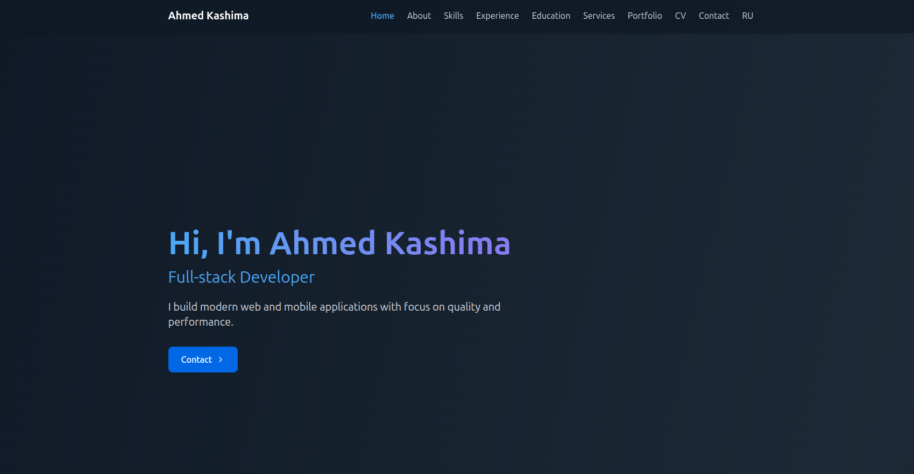
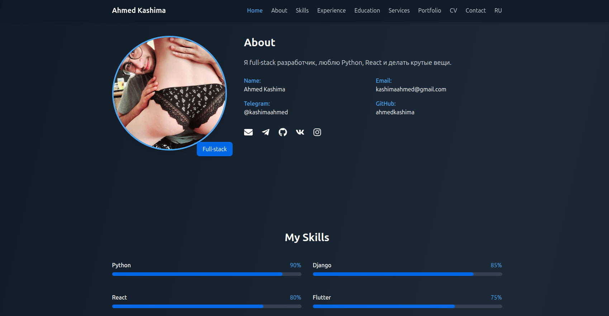

# Ahmed Kashima - Full Stack Developer Portfolio

<!-- [](https://ahmedkashima.github.io)
[](LICENSE) -->


<div align="center">
  
</div>

<div align="center">
  
</div>
<!--  -->

## 🚀 Technologies Used

### Frontend
<p align="left">
  
  
  
  
</p>

### Backend
<p align="left">
  
  
  
</p>

## ✨ Features

- **Modern UI/UX** with smooth animations
- **Responsive Design** works on all devices
- **Multi-language** support (English/Russian)
- **Interactive Elements** with Framer Motion
- **Contact Form** with email integration
- **Project Showcase** with case studies


## 🚀 Deployment

### Vercel (Recommended)
```bash
npm install -g vercel
vercel
```

### gitHub Pages
```bash
npm install -g vercel
vercel
```
## Docker 
```bash
docker compose up --build
```

## npm
```bash
npm start
```
## Fast Compile
```bash 
cd reall-niggaa/deeppersonal/
docker compose up --build
```
## New window
```bash 
cd reall-niggaa/deeppersonal/frontend/
npm i 
npm start 
```

<div align="center"> <a href="https://github.com/AhmedKashima">  </a> 
 <a href="mailto:kashimaahmed@email.com">  </a> </div> 