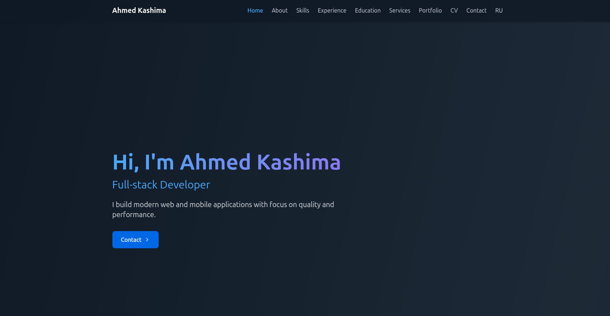
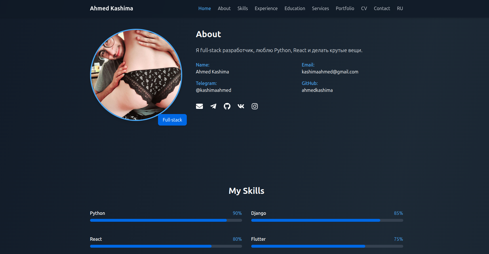

# Ahmed Kashima - Full Stack Developer Portfolio

<!-- [](https://ahmedkashima.github.io)
[](LICENSE) -->


<div align="center">
  
</div>

<div align="center">
  
</div>
<!--  -->

## 🚀 Technologies Used

### Frontend
<p align="left">
  
  
  
  
</p>

### Backend
<p align="left">
  
  
  
</p>

## ✨ Features

- **Modern UI/UX** with smooth animations
- **Responsive Design** works on all devices
- **Multi-language** support (English/Russian)
- **Interactive Elements** with Framer Motion
- **Contact Form** with email integration
- **Project Showcase** with case studies


## Docker 
```bash
docker compose up --build
```

## npm
```bash
npm start
```
## Fast Compile
```bash 
cd reall-niggaa/deeppersonal/
docker compose up --build
```
## New window
```bash 
cd reall-niggaa/deeppersonal/frontend/
npm i 
npm start 
```


# 🚀 Deploying React (CRA or Vite) + TypeScript Frontend to GitHub Pages

This guide describes how to deploy your frontend (React + TypeScript) to GitHub Pages using `gh-pages`.

---

## ✅ Prerequisites

- Node.js and npm installed
- A GitHub repository, for example:  
  `https://github.com/ahmedkashima/reall-niggaa`
- React frontend already created inside the `/frontend` directory

---

## 📦 Step 1: Install `gh-pages`

Navigate to your frontend directory and install `gh-pages`:

```bash
cd frontend
npm install gh-pages --save-dev
```

## 📝 Step 2: Update package.json
Add the homepage field:
```bash
"homepage": "https://ahmedkashima.github.io/reall-niggaa",
```

### Add deploy scripts:
```bash
"scripts": {
  "predeploy": "npm run build",
  "deploy": "gh-pages -d build",
  ...
}
```
## ⚙️ Step 3: Set base path for assets
If using Create React App (CRA):
Edit public/index.html and add inside (head>:

<(base href="%PUBLIC_URL%/" />

If using Vite:
In your vite.config.ts or vite.config.js, add:

```bash
typescript
base: "/reall-niggaa/",
```

## 🚀 Step 4: Deploy
From your /frontend directory, run:

```bash
npm run build
npm run deploy
```

<div align="center"> <a href="https://github.com/AhmedKashima">  </a> 
 <a href="mailto:kashimaahmed@email.com">  </a> </div> 
